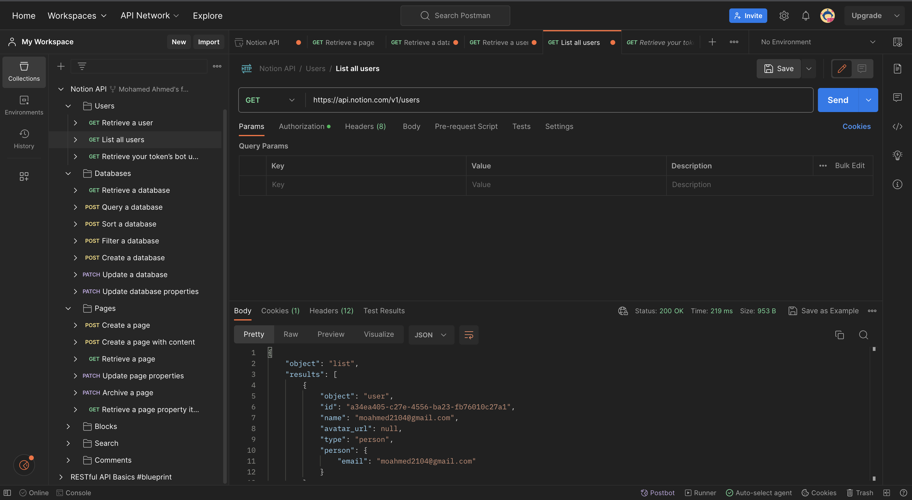
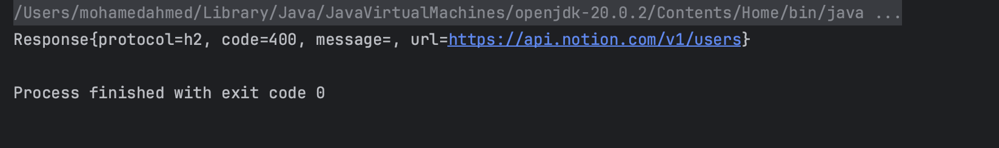

# Productivity Tool
### Project Domain
Productivity and Organization
### Description
A productivity tool which has various organizational functions such as a calendar, a to-do list, and note taking. The tool will also feature integrations with many other organizational tools like Notion, Google Calendar, Google Drive, and OneNote.
### APIs
#### [Notion Documentation](https://developers.notion.com/)
#### Postman Screenshot

### Sample Output

### Authors
Mohamed Ahmed, Chris Solis, Nadim Mottu, Saahir Sultan